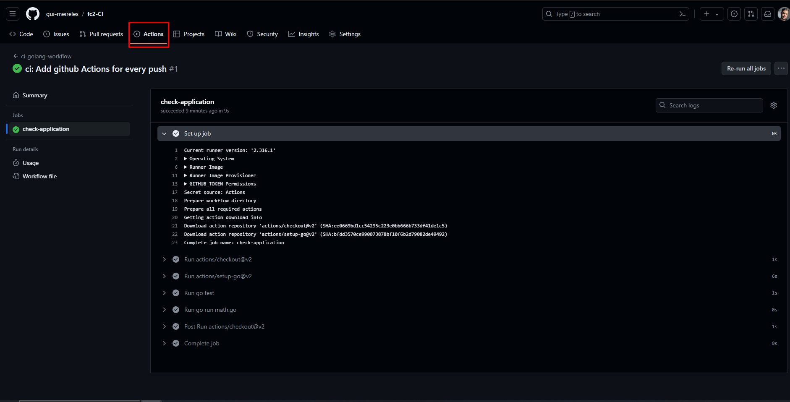
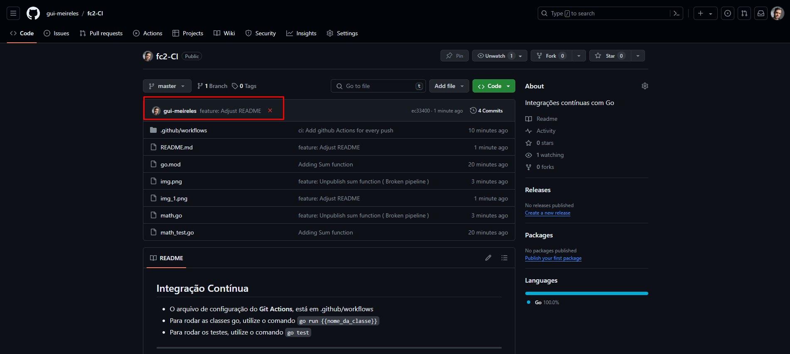
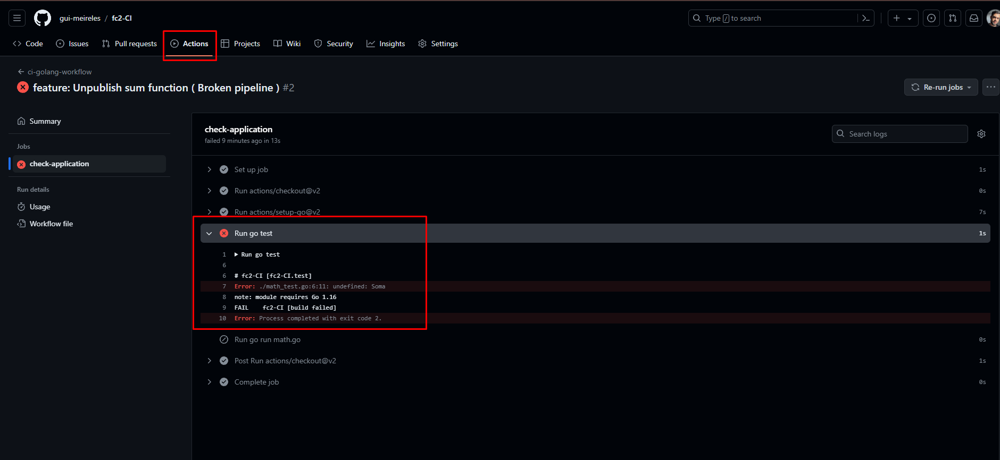

## Integração Contínua

- O arquivo de configuração do **Git Actions**, está em .github/workflows
- Para rodar as classes go, utilize o comando `go run {{nome_da_classe}}`
- Para rodar os testes, utilize o comando `go test`

- Docs: https://docs.github.com/pt/actions/guides

---

### Fazendo o commit passar na pipeline

- Sempre que for realizado um push na branch `Master`, ele rodará as ações
do `ci.yaml`, e conseguiremos ver os testes realizados na aba **`Actions`**
do nosso repositório

---

### Fazendo o commit reprovar na pipeline

- Ao mudarmos o nome da função da classe `math.go` e não atualizarmos
na classe de teste, ao fazer o push e rodar a pipeline, nosso teste
não passará.

---

### Faça pull request para a develop

- Ao fazer pull request para a branch develop, vamos obrigar o nosso
código a passar pela pipeline do Actions.