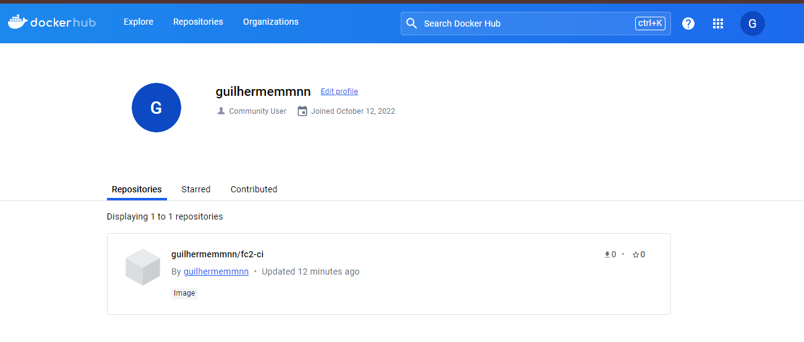
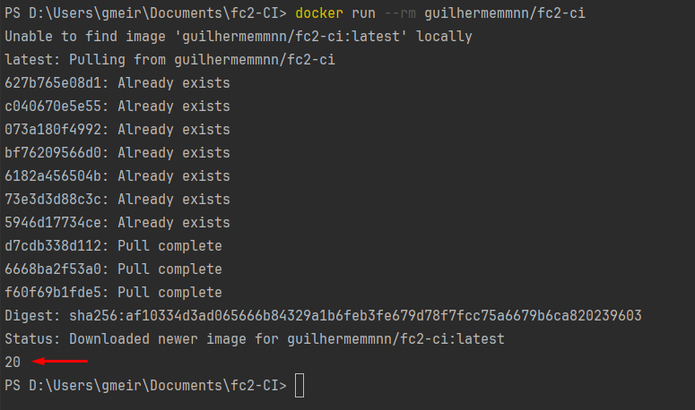

## Integração Contínua

- O arquivo de configuração do **Git Actions**, está em .github/workflows
- Para rodar as classes go, utilize o comando `go run {{nome_da_classe}}`
- Para rodar os testes, utilize o comando `go test`

- Docs: https://docs.github.com/pt/actions/guides

---

### Fazendo o commit passar na pipeline

- Na primeira vez que subir o projeto no GitHub, precisará configurar o job que rodará
toda vez que fizer um pull request ou commit na branch.
- **Para mudar se será pull request ou commit, mude no `ci.yaml`.**
- Para adicionar o `check-application` no GitHub, siga o gif abaixo:

 

- Sempre que for realizado um push na branch `Master`, ele rodará as ações
do `ci.yaml`, e conseguiremos ver os testes realizados na aba **`Actions`**
do nosso repositório

---

### Fazendo o commit reprovar na pipeline

- Ao mudarmos o nome da função da classe `math.go` e não atualizarmos
na classe de teste, ao fazer o push e rodar a pipeline, nosso teste
não passará.

---

### Faça pull request para a develop

- Ao fazer pull request para a branch develop, vamos obrigar o nosso
código a passar pela pipeline do Actions.

---

### Dockerfile (Criar uma imagem do nosso projeto)

- Temos um Dockerfile que gera um container do nosso projeto GoLang
- Para criar o container, digite o comando na raiz do projeto: `docker build -t teste .`
- Para roda-lo na sua máquina, digite o comando: `docker run --rm teste`, o resultado deve ser 20.

---

### GitHub Actions e Docker

- Podemos testar nossas imagens Docker no GitHub Actions, a configuração
estará no arquivo `ci.yaml`, porém vou deixar a documentação abaixo:
> https://github.com/marketplace/actions/build-and-push-docker-images

---

### Cadastrar secrets do DockerHub no GitHub

- Alguns dados pessoais não podem ser colocados em repositórios públicos,
com isso, podemos cadastra-los dentro de nossa conta do GitHub, como é
o caso das nossas secrets de **~~Username~~** e **~~Token~~** do **DockerHub** dentro do `ci.yaml`.
- Dentro do seu projeto no Git, abra `Settings`, expanda `Secrets and variables`,
clique em `Actions` e logo após em `New Repository Secret`

**~~Obs:~~** Tenha uma conta no DockerHub: https://hub.docker.com/

- Quando fizer esses passos e fizer um pull request para a develop,
verá que no fim do `check-application`, você terá uma imagem no seu
DockerHub.

> Caso queira baixar e rodar essa imagem do DockerHub em sua máquina,
basta digitar `docker run --rm guilhermemmnn/fc2-ci`.
